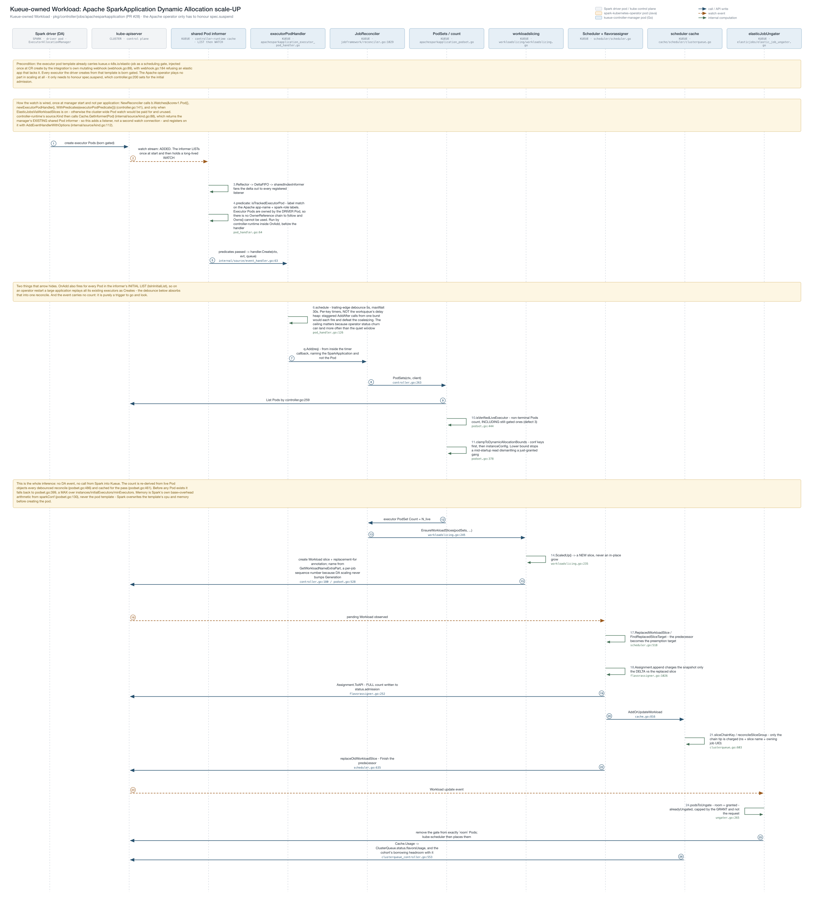
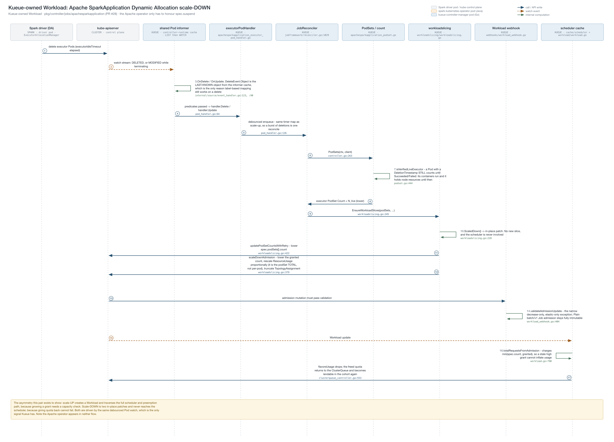
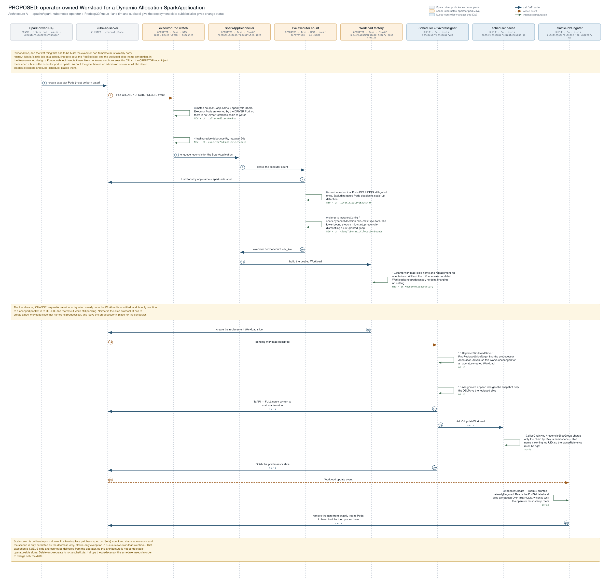

# Sequence diagrams: how Kueue infers Spark Dynamic Allocation scaling

Companion visuals for
[`sparkapplication-elastic-scaling-design.md`](../sparkapplication-elastic-scaling-design.md)
(§2.3, §3) and
[`sparkapplication-executor-quota-gate-design.md`](../sparkapplication-executor-quota-gate-design.md).
They trace one scale-up and one scale-down end to end, naming the owning Go file on every
arrow.

The premise worth stating up front: **nothing is intercepted.** Spark's Dynamic Allocation
never calls Kueue. The driver's `ExecutorAllocationManager` creates and deletes executor
Pods directly against the API server, bypassing the `SparkApplication` CR entirely. Kueue
*infers* scaling by watching those Pods and re-deriving a count.

## Scale-up


## Scale-down


## The Apache integration under Dynamic Allocation

`pkg/controller/jobs/apachesparkapplication` (PR #28) handling a Dynamic Allocation scale-up and
scale-down. This is the **Kueue-owned Workload** design, and the one in use: the Apache operator's
own Kueue path is switched off (`spark.kubernetes.operator.kueue.enabled=false`) so that only one
side creates a Workload.

### Scale-up



### Scale-down



Almost every lane is Kueue-side, and **the Apache operator appears in neither flow** - it only has
to honour `spec.suspend` for the initial admission. That is the contrast with the operator-owned
alternative below, where four of nine lanes move into the operator.

Generated by `gen_apache_kueue_seq.py`. Its `A_SYMBOLS` table resolves the
`apachesparkapplication` references from source through the same machinery `gen_seq.py` uses for
the generic packages, so neither set can rot.

## Proposed: an operator-owned Workload (Architecture A)

Not how the code works today. This traces what it would take for the **Apache** operator to own
the Kueue Workload for a Dynamic Allocation application, per
[`apache-sparkapplication-integration-design.md`](../apache-sparkapplication-integration-design.md)
§§2b–2d. Generated by `gen_apache_da_seq.py`, which imports the helpers from `gen_seq.py`.



Lane **tint** and sublabel both give the deployment side — tinted for colour, spelled out in the
sublabel so the diagram survives greyscale printing:

| Tint | Deployed in |
|---|---|
| neutral grey | the Spark driver pod, or the Kubernetes control plane |
| amber | the `spark-kubernetes-operator` pod — Java |
| blue | the `kueue-controller-manager` pod — Go |

Each sublabel also carries a change status: **NEW** Java to write, an existing component that
must **CHANGE**, or usable **as-is**. Four operator lanes, three Kueue lanes — and the split is
the point: everything Workload-level is reusable as-is, everything job-level is new Java.

The two callouts carry the load: the operator must inject the scheduling gate and the PodSet
label itself (no Kueue webhook sees the CR in this design), and `requestAdmission` must stop
returning early on an admitted Workload and stop delete-and-recreating a changed one. Scale-down
is deliberately absent — it needs the decrease-only admission exception, which is Kueue-side and
cannot be delivered from the operator.

## Reading the diagrams

| Notation | Meaning |
|---|---|
| solid blue arrow | direct call, or a write to the API server |
| dashed amber arrow | watch event delivered to a controller |
| green self-loop | computation internal to that component |
| amber callout | a precondition or a consequence worth flagging inline |

Lane headers name the owning file; each arrow carries `file.go:line`.

## How the executor Pod watch is wired

All four Dynamic Allocation flows now show this explicitly, because it is the step most easily
misread: **nothing is pushed from Spark.** Dynamic Allocation never calls Kueue. The driver's
`ExecutorAllocationManager` writes executor Pods straight to the API server, and Kueue learns
about them the ordinary way — off a watch stream — which is why there is a `shared Pod informer`
lane between `kube-apiserver` and `executorPodHandler`.

Registration happens **once at manager start, not per application**, and is drawn as the callout
at the top of each up-flow:

1. `NewReconciler` calls `b.Watches(&corev1.Pod{}, newExecutorPodHandler(), WithPredicates(executorPodPredicate{}))`
   — only when `ElasticJobsViaWorkloadSlices` is on, so a cluster-wide Pod watch is not paid for
   when the feature it exists for is off.
2. controller-runtime's `source.Kind` calls `Cache.GetInformer(Pod)`, which returns the manager's
   **existing** shared informer — a listener is added, not a second watch connection.
3. It registers `NewEventHandler(ctx, queue, handler, predicates)` on that informer.

Delivery per event: API server emits `ADDED`/`MODIFIED`/`DELETED` → Reflector → `DeltaFIFO` →
`sharedIndexInformer` fans out → controller-runtime's `OnAdd`/`OnUpdate`/`OnDelete` builds the
typed event, **runs the predicate**, and only then invokes the handler → `schedule()` starts a
per-key debounce timer → `q.Add(req)` fires later from the timer callback, naming the
**SparkApplication, not the Pod**.

Three details the flows call out because each one surprises people:

- **`Owns()` cannot be used.** Executor Pods are owned by the *driver Pod*, so there is no
  OwnerReference chain back to the SparkApplication. Hence a hand-written handler that maps by
  label.
- **`OnAdd` also fires for the informer's initial LIST** (`IsInInitialList`), so an operator
  restart replays every existing executor as a Create. The debounce absorbs that into one
  reconcile.
- **The event carries no count.** It is purely a trigger; `computeLiveExecutorCount` re-lists.
  That is why coalescing events loses nothing and a missed event self-corrects.

## The asymmetry the pair is meant to show

**Scale-up** spans all nine lanes: it creates a *new* Workload slice and traverses the
full scheduler and preemption path, ending with the ungater releasing exactly
`granted − alreadyUngated` Pods.

**Scale-down** stops at the workloadslicing lane. It is two in-place patches — one to
`spec.podSets[].count`, one to `status.admission` — plus the narrow decrease-only webhook
exception that permits the second. The scheduler is never involved.

Both are driven by the same debounced Pod watch (5s debounce, 30s max wait), which is the
only signal Kueue has.

## Known coupling visible in the up-flow

Step 8 (`isVerifiedLiveExecutor`) counts every non-terminal executor Pod, **including Pods
still blocked by `kueue.ElasticJobSchedulingGate`** — Pods that step 22 has not ungated. When
a ClusterQueue is saturated this is self-reinforcing: blocked admission leaves Pods gated,
gated Pods raise the derived count, a higher count is harder to admit.

PR #26 added `clampToDynamicAllocationBounds`, which **narrows but does not close** this. It
bounds the derived count by Dynamic Allocation's own `maxExecutors`, not by what the
ClusterQueue can grant, so the loop is still reachable when `maxExecutors` is unset or set
above queue capacity. A full fix has to bound the count against grantable capacity rather
than filter gated Pods out, since gated Pods must be counted for scale-up to be detectable at
all.

## Regenerating

`gen_seq.py` emits both SVGs **in place, beside itself**, and shells out to `rsvg-convert`
for the PNGs:

```sh
python3 docs/design/diagrams/gen_seq.py          # the two as-built diagrams
python3 docs/design/diagrams/gen_apache_da_seq.py # the proposed Architecture A diagram
```

`gen_apache_da_seq.py` imports `build`/`call`/`event`/`self_`/`note`/`seq`/`render` from
`gen_seq.py`, whose output block is guarded by `if __name__ == "__main__"` so importing it does
not regenerate the as-built pair. Because it describes code that does not exist yet, **nothing in
it is resolved from source** — its refs are prose like `NEW · cf. isVerifiedLiveExecutor`,
pointing at the Go original the Java would mirror.

Participants and steps are plain Python lists near the bottom of the script (`UP_LANES` /
`UP`, `DOWN_LANES` / `DOWN`); message helpers are `call()`, `event()`, `self_()` and
`note()`. Step numbers are assigned automatically, so inserting a step renumbers the rest.
No network access or JS runtime is needed.

**Code references are resolved from the source at generation time.** The `SYMBOLS` table maps
a key to `(path, regex, display label)`, and `ref()` / `refs()` turn that into `file.go:NNN`
when the script runs. They were hardcoded until 2026-09-21, by which point 14 of 17 had
rotted — #26–#35 moved `isVerifiedLiveExecutor` from 119 to 176 and
`totalRequestsFromAdmission` from 674 to 790, among others. A stale line number is worse than
none, because it reads as precise.

Consequence worth knowing: if a referenced symbol is renamed or removed, the script **exits
non-zero with the key that no longer matches** rather than emitting a wrong number. Fix
`SYMBOLS`; don't drop the reference.
