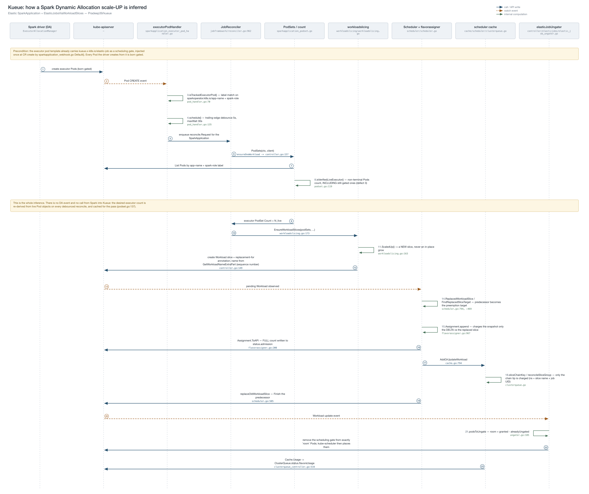
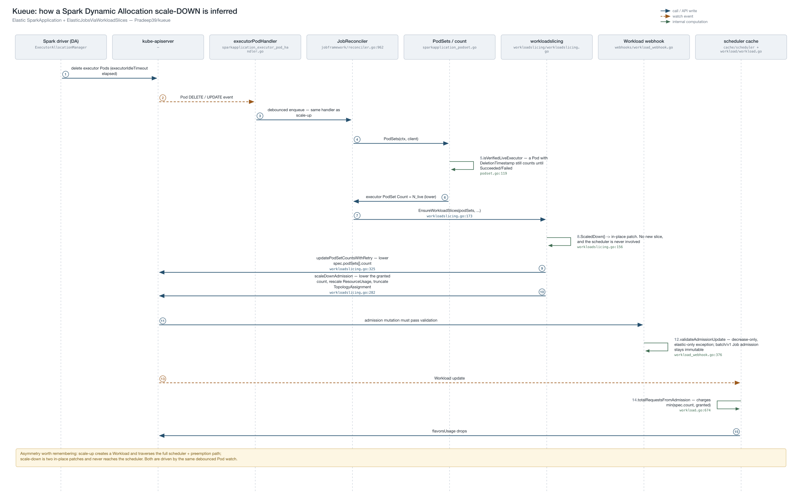

# Sequence diagrams: how Kueue infers Spark Dynamic Allocation scaling

Companion visuals for
[`sparkapplication-elastic-scaling-design.md`](../sparkapplication-elastic-scaling-design.md)
(§2.3, §3) and
[`sparkapplication-executor-quota-gate-design.md`](../sparkapplication-executor-quota-gate-design.md).
They trace one scale-up and one scale-down end to end, naming the owning Go file on every
arrow.

The premise worth stating up front: **nothing is intercepted.** Spark's Dynamic Allocation
never calls Kueue. The driver's `ExecutorAllocationManager` creates and deletes executor
Pods directly against the API server, bypassing the `SparkApplication` CR entirely. Kueue
*infers* scaling by watching those Pods and re-deriving a count.

## Scale-up



## Scale-down



## Reading the diagrams

| Notation | Meaning |
|---|---|
| solid blue arrow | direct call, or a write to the API server |
| dashed amber arrow | watch event delivered to a controller |
| green self-loop | computation internal to that component |
| amber callout | a precondition or a consequence worth flagging inline |

Lane headers name the owning file; each arrow carries `file.go:line`.

## The asymmetry the pair is meant to show

**Scale-up** spans all nine lanes: it creates a *new* Workload slice and traverses the
full scheduler and preemption path, ending with the ungater releasing exactly
`granted − alreadyUngated` Pods.

**Scale-down** stops at the workloadslicing lane. It is two in-place patches — one to
`spec.podSets[].count`, one to `status.admission` — plus the narrow decrease-only webhook
exception that permits the second. The scheduler is never involved.

Both are driven by the same debounced Pod watch (5s debounce, 30s max wait), which is the
only signal Kueue has.

## Known coupling visible in the up-flow

Step 8 (`isVerifiedLiveExecutor`, `sparkapplication_podset.go:119`) counts every
non-terminal executor Pod, **including Pods still blocked by
`kueue.ElasticJobSchedulingGate`** — Pods that step 22 has not ungated. When a
ClusterQueue is saturated this is self-reinforcing: blocked admission leaves Pods gated,
gated Pods raise the derived count, a higher count is harder to admit. Any fix has to
*bound* the derived count rather than filter gated Pods out, since gated Pods must be
counted for scale-up to be detectable at all.

## Regenerating

`gen_seq.py` emits both SVGs and shells out to `rsvg-convert` for the PNGs:

```sh
python3 docs/design/diagrams/gen_seq.py
```

Participants and steps are plain Python lists at the bottom of the script (`UP_LANES` /
`UP`, `DOWN_LANES` / `DOWN`); message helpers are `call()`, `event()`, `self_()` and
`note()`. Step numbers are assigned automatically, so inserting a step renumbers the rest.
No network access or JS runtime is needed.
