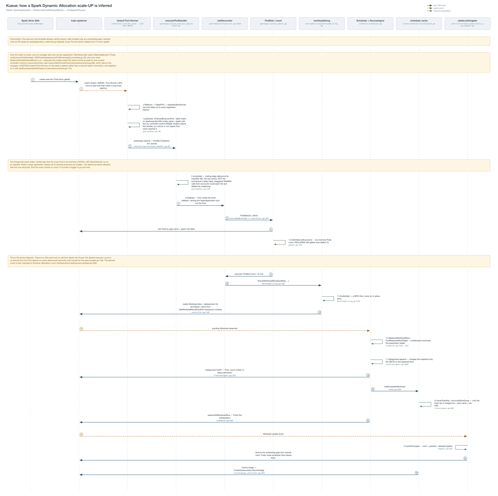
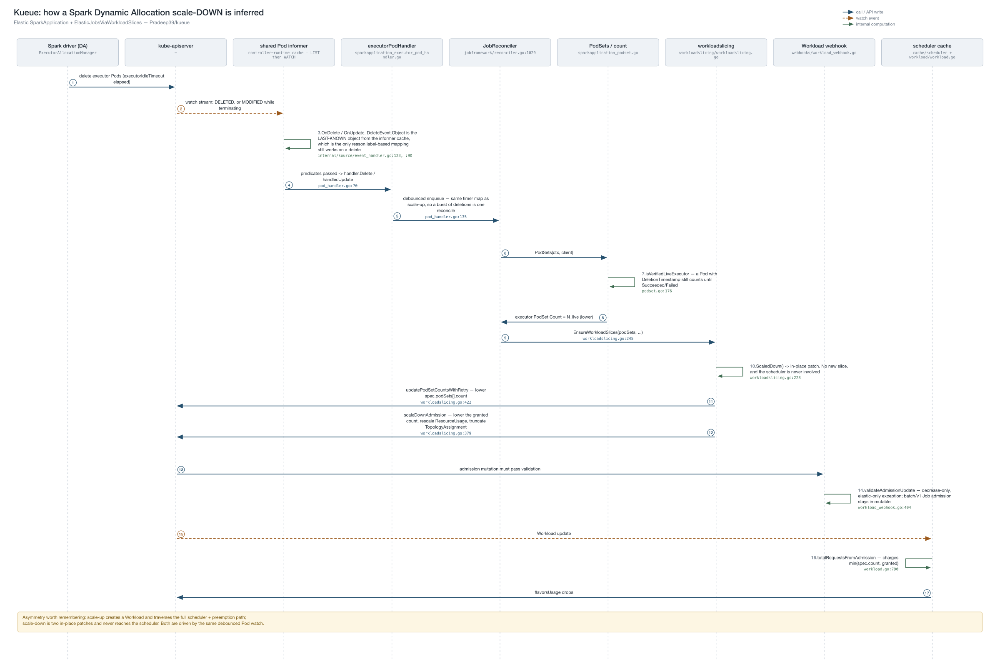

# SparkApplication Dynamic Allocation: design

Supplementary design detail for [Story 4](README.md#story-4---sparkapplication-with-spark-dynamic-allocation)
and [Beta: Phase 4](README.md#beta-phase-4--sparkapplication-workloadslice-support-with-spark-dynamic-allocation)
of KEP-77. Applies to `sparkoperator.k8s.io/v1beta2` `SparkApplication` with
`spark.dynamicAllocation.enabled=true`.

## 1. Why this needs a different mechanism

For `batch/v1.Job` and `RayCluster`, a scale event *is* a spec update: the user changes
`parallelism` or `replicas`, Kueue sees the update, and the desired size is right there in the
object.

Spark Dynamic Allocation has neither property. The driver's `ExecutorAllocationManager` decides
when to add or remove executors and creates or deletes their Pods **directly against the API
server**. It never writes to the `SparkApplication` and never calls Kueue. So:

- There is no spec change to react to.
- `spec.executor.instances` describes what the driver *started* with, not what is running.

The desired size must therefore be **inferred from the executor Pods that exist**. Everything
below follows from that one constraint.

## 2. Deriving the count

**The signal is a Pod watch.** The integration watches `corev1.Pod` and maps each event back to
the owning `SparkApplication` via the Spark Operator's `sparkoperator.k8s.io/app-name` label,
which the operator's webhook stamps on every driver and executor Pod — including ones Dynamic
Allocation creates long after admission.

`Owns()` cannot be used: executor Pods are owned by the **driver Pod**, so there is no
OwnerReference chain from an executor back to the `SparkApplication`. The watch is registered only
when `ElasticJobsViaWorkloadSlices` is enabled, so a cluster-wide Pod watch is not paid for when
the feature is off.

**Events are coalesced, not accumulated.** Dynamic Allocation creates and deletes Pods in bursts.
A trailing-edge debounce (5s, with a 30s ceiling so continuous status churn cannot starve the
reconcile indefinitely) collapses a burst into one reconcile. The ceiling matters because a
long-running application with many executors sees routine Pod status churn more often than the
quiet window.

Crucially, **an event carries no count** — it is only a trigger. Each reconcile re-lists the live
executor Pods and counts them afresh. A coalesced, duplicated or missed event therefore cannot
corrupt the accounting, and no counter can drift. (An increment/decrement counter would drift the
first time Dynamic Allocation deleted a Pod the controller did not observe.)

**What counts.** An executor Pod counts from the moment it exists until it reaches `Succeeded` or
`Failed`. Two inclusions are deliberate:

| Pod state | Counted | Why |
|---|---|---|
| `Pending`, still gated | yes | A gated Pod is precisely the evidence that Dynamic Allocation wants to grow. Excluding gated Pods would mean a scale-up is never detected and the application deadlocks at its current grant. |
| terminating, not yet terminal | yes | Its containers still run and it still occupies node resources until it reaches a terminal phase. Dropping it when the delete is issued would undercount live Pods and manufacture spurious intermediate counts while a batch of deletions drains. |

**The derived count is clamped** to Dynamic Allocation's own `minExecutors`/`maxExecutors`. The
lower bound is the non-obvious half and is load-bearing: the derivation switches from the declared
initial count to the observed count as soon as a single Pod exists, so a reconcile landing while
the driver is still creating its initial executors sees a transient *prefix* of them — which is
indistinguishable from a real scale-down. Without a floor, that observation lowers the grant and
dismantles the gang that was just admitted. The maximum is applied last, so a configuration with
`minExecutors > maxExecutors` cannot inflate the count above the declared maximum.

Before any executor Pod exists, the count comes from Spark's own rule: the **maximum** of
`minExecutors`, `initialExecutors` and the resolved instances count, matching
`Utils.getDynamicAllocationInitialExecutors`. Spark starts the largest of the three regardless of
which the author considered authoritative, so resolving them by precedence would under-reserve.

## 3. Applying the count

Scale-up and scale-down are not symmetric, and the asymmetry is imposed by what each one needs
from the scheduler.

**Scale-up creates a new Workload slice** naming its predecessor, and leaves the predecessor in
place. Growing a grant needs a capacity check, and the slice mechanism is what provides it: the
scheduler charges only the delta against the predecessor's existing usage, and the predecessor
becomes the preemption target if the delta does not fit. The newly created executor Pods stay
gated until the replacement is admitted, at which point exactly `granted − alreadyUngated` Pods
are released — capped by the **grant**, not by the request, so Pods that hold no quota are never
ungated.

**Scale-down patches the existing slice in place** — the requested count first, then the grant,
with the recorded resource usage rescaled proportionally. Returning quota cannot fail, so no
capacity check and no new slice is needed. The scheduler is never involved. Deleting and
recreating the Workload would be wrong here: it would drop the predecessor the scheduler needs in
order to charge only a delta on the next scale-up.

Slice names use a **monotonic per-job sequence number** rather than `metadata.generation`, because
Dynamic Allocation scaling never modifies the `SparkApplication` and so never bumps it. Deriving
names from the observed count instead would collide with a superseded-but-not-yet-deleted slice
that already claimed that name.

## 4. Quota accounting across overlapping slices

A scale-up briefly leaves two slices of one job in the scheduler cache: the replacement is
admitted synchronously, while the predecessor is finished asynchronously. Both describe the same
Pods. Counting both charges the overlap twice and can push a ClusterQueue's reported usage above
its nominal quota for the duration.

Usage is therefore accounted **per slice chain**: all slices of one job map to a single chain, and
only the chain's latest cached slice contributes. This is declarative rather than event-driven, so
it holds whether or not the predecessor's finish lands, and it is idempotent if a slice is
re-added to the cache.

The chain key is namespace + the chain-root Workload name + **the owning job's UID**. The UID is
required, not defensive: a deleted-and-recreated application's slices can inherit the previous
instance's chain-root name, and without the UID two independent instances would share a chain and
only the newest would be counted — an *under*-charge.

Superseded slices are also excluded from preemption candidates. Otherwise preempting one would
subtract usage that was never added, releasing phantom capacity and over-admitting.

## 5. Interaction with an in-place grant decrease

Lowering an admitted grant is normally forbidden — `status.admission` is immutable once set. The
scale-down path needs a narrow exception, keyed off the Workload's elastic-job annotation and
permitting **decrease only**. This mirrors the existing exception for `spec.podSets[].count` on
elastic jobs. Plain `batch/v1.Job` admission stays fully immutable.

## 6. Known limitation

Gated executor Pods are counted (§2), which is required for scale-up to be detectable at all. The
consequence is a feedback loop when a ClusterQueue is saturated: blocked admission leaves Pods
gated, gated Pods raise the derived count, and a higher count is harder to admit.

The clamp in §2 narrows this but does not close it, because it bounds the count by Dynamic
Allocation's own ceiling rather than by what the ClusterQueue can grant. A complete fix has to
bound the requested count against grantable capacity; filtering gated Pods out is not an option,
since that reintroduces the deadlock. This is recorded as a follow-up rather than a blocker: the
loop is self-limiting once Spark's `executorIdleTimeout` reaps the surplus Pods.

## 7. Enablement

Requires the `ElasticJobsViaWorkloadSlices` feature gate, the `SparkApplicationIntegration` gate,
and `sparkoperator.k8s.io/sparkapplication` in `integrations.frameworks`. Individual applications
opt in with the workload-slice annotation, exactly as for `batch/v1.Job` and `RayCluster`; an
application without it is admitted at a static count and never re-derived.
